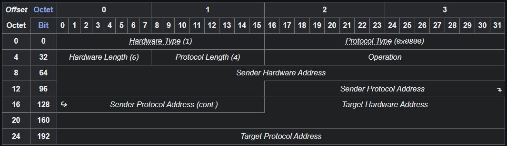

# Address Resolution Protocol (ARP)

Is a [communication protocol](https://en.wikipedia.org/wiki/Communication_protocol "Communication protocol") for discovering the [link layer](https://en.wikipedia.org/wiki/Link_layer "Link layer") address, such as a [MAC address](https://en.wikipedia.org/wiki/MAC_address "MAC address"), associated with an [internet layer](https://en.wikipedia.org/wiki/Internet_layer "Internet layer") address, typically an [IPv4 address](https://en.wikipedia.org/wiki/IPv4_address).

# How ARP Works?

.gif)

1. ****ARP Cache:**** After resolving the MAC address, the ARP sends it to the source where it is stored in a table for future reference. The subsequent communications can use the MAC address from the table.
2. ****ARP Cache Timeout:**** It indicates the time for which the MAC address in the ARP cache can reside.
3. ****ARP request:**** This is nothing but broadcasting a packet over the network to validate whether we came across the destination MAC address or not.
   * The physical address of the sender.
   * The IP address of the sender.
   * The physical address of the receiver is FF:FF:FF:FF:FF: FF or 1’s.
   * The IP address of the receiver

# ARP Header

# ARP Probe

* **SHA** (Sender Hardware Address) — MAC отправителя указывается нормально.
* **SPA** (Sender Protocol Address) — ставится `0.0.0.0`.
* **THA** (Target Hardware Address) — ставится `00:00:00:00:00:00`.
* **TPA** (Target Protocol Address) — адрес, который хост хочет использовать и проверяет.

Проверка на занятость ip4 адреса.

# ARP Announcements

ARP may also be used as a simple announcement protocol. This is useful for updating other hosts' mappings of a hardware address when the sender's IP address or MAC address changes. Such an announcement, also called a **gratuitous ARP** (**GARP**) message, is usually broadcast as an *ARP request* containing the SPA in the target field (TPA=SPA), with THA set to zero. An alternative way is to broadcast an *ARP reply* with the sender's SHA and SPA duplicated in the target fields (TPA=SPA, THA=SHA).

# ARP Mediation

Каждый Provider Edge (PE) выполняет два действия:

1. **Определяет IP-адрес локального CE**
   PE узнаёт, какой IP имеет устройство, подключенное к нему с клиентской стороны.
2. **Передаёт этот IP удалённому PE**
   PE1 сообщает PE2: «Мой CE имеет IP X».
   PE2 сообщает PE1: «Мой CE имеет IP Y».

После этого на каждом PE есть полная информация о двух CE.

3. **PE отвечает на ARP запросы от своего CE**
   Например, CE1 отправляет ARP-запрос: «Кто имеет IP Y?»
   Он ждёт MAC CE2 — но CE2 в другой сети, и невозможно передать ARP напрямую.
   Поэтому PE1 сам отвечает:

   * даёт **IP удалённого CE (Y)**,
   * но подставляет **свой MAC-адрес**, а не MAC CE2.

   Для CE1 это выглядит так, словно CE2 находится рядом.

Фактически PE устройств играют роль ARP-прокси, создавая иллюзию прямой L2-связи.

# Inverse ARP

**Inverse Address Resolution Protocol** (**Inverse ARP** or **InARP**) is used to obtain [network layer](https://en.wikipedia.org/wiki/Network_layer "Network layer") addresses (for example, [IP addresses](https://en.wikipedia.org/wiki/IP_address "IP address")) of other nodes from [data link layer](https://en.wikipedia.org/wiki/Data_link_layer "Data link layer") (Layer 2) addresses. Since ARP translates layer-3 addresses to layer-2 addresses, InARP may be described as its inverse. In addition, InARP is implemented as a protocol extension to ARP: it uses the same packet format as ARP, but different operation codes.

# ARP spoofing and proxy ARP

Because ARP does not provide methods for authenticating ARP replies on a network, ARP replies can come from systems other than the one with the required Layer 2 address. An ARP *proxy* is a system that answers the ARP request on behalf of another system for which it will forward traffic, normally as a part of the network's design, such as for a dialup internet service. By contrast, in ARP *spoofing* the answering system, or *spoofer*, replies to a request for another system's address with the aim of intercepting data bound for that system. A malicious user may use ARP spoofing to perform a [man-in-the-middle](https://en.wikipedia.org/wiki/Man-in-the-middle "Man-in-the-middle") or [denial-of-service](https://en.wikipedia.org/wiki/Denial-of-service "Denial-of-service") attack on other users on the network. Various software exists to both detect and perform ARP spoofing attacks, though ARP itself does not provide any methods of protection from such attacks.
