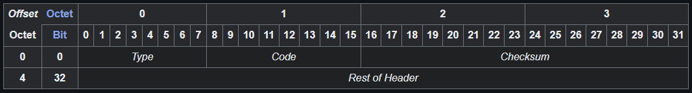

# ICMP (Internet Control Message Protocol)

The **Internet Control Message Protocol** (**ICMP**) is a supporting [protocol](https://en.wikipedia.org/wiki/Communications_protocol "Communications protocol")^[[2]](https://en.wikipedia.org/wiki/Internet_Control_Message_Protocol#cite_note-rfc792-2)^ in the [Internet protocol suite](https://en.wikipedia.org/wiki/Internet_protocol_suite "Internet protocol suite"). It is used by [network devices](https://en.wikipedia.org/wiki/Network_device "Network device"), including [routers](https://en.wikipedia.org/wiki/Router_(computing)) "Router (computing)"), to send error messages and operational information indicating success or failure when communicating with another [IP address](https://en.wikipedia.org/wiki/IP_address "IP address"). For example, an error is indicated when a requested service is not available or that a [host](https://en.wikipedia.org/wiki/Host_(network)) "Host (network)") or router could not be reached. ICMP differs from [transport protocols](https://en.wikipedia.org/wiki/Transport_protocol "Transport protocol") such as [TCP](https://en.wikipedia.org/wiki/Transmission_Control_Protocol "Transmission Control Protocol") and [UDP](https://en.wikipedia.org/wiki/User_Datagram_Protocol "User Datagram Protocol") in that it is not typically used to exchange data between systems, nor is it regularly employed by end-user network applications (with the exception of some diagnostic tools like [ping](https://en.wikipedia.org/wiki/Ping_(networking_utility)) "Ping (networking utility)") and [traceroute](https://en.wikipedia.org/wiki/Traceroute "Traceroute")).

# Header

